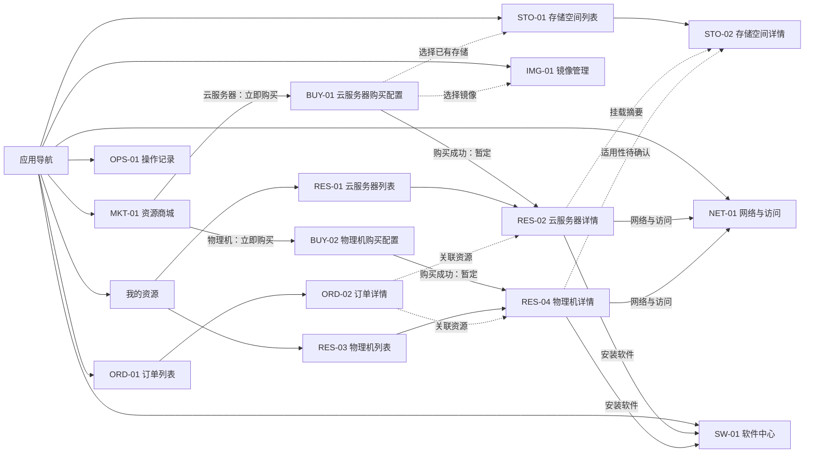

# 信息架构

> 文档状态：需求基线（实施前）
>
> 产品工作名：算力资源服务平台（非正式名称）
> 本文只定义产品信息结构与导航关系，不定义计费、审批、权限或资源状态机。

## 1. 口径与状态

| 标记 | 含义 |
|---|---|
| 已确认 | 来自会后修正、会议拍板或多人一致，可作为本期需求基线 |
| 暂定 | 为使原型和后续开发可以推进而采用的信息架构方案，不等同于业务拍板 |
| 待确认 | 会影响字段、流程或实现，但当前材料没有可靠结论 |
| 非本期 | 材料已明确不应并入本产品，或当前基线主动排除 |

来源简写：`会议 00:08:18（L377–379）` 表示会议转写时间点及源文件行号；`会后补充 §系统盘` 表示会后补充章节。

## 2. 架构原则

1. **产品是完整、独立的机器资源产品，而不是只有商城的一页。** 商城负责发现和购买，购买后的资源管理、监控、存储、网络、软件与记录由独立模块承载。（已确认；会议 00:06:25–00:08:36，L281–397）
2. **商品只有云服务器和物理机两类。** 是否带 GPU 是规格差异，不新增第三种商品类型。（已确认；会议 00:02:15，L89–92；00:06:25，L281–284）
3. **产品与 AI 开发平台分离。** 本产品直接交付机器，用户自行使用；Notebook、训练、推理等受管流程属于 AI 开发平台，不并入本产品。（已确认；会议 00:16:14–00:17:31，L749–811）
4. **资源为购买用户独占。** 本期不设计资源共享入口或共享权限体系。（已确认；会议 00:07:25–00:07:34，L311–331）
5. **商城与资源管理分离。** 开关机、连接信息、监控、安装软件、开放端口等不放在商城。（已确认；会议 00:08:12–00:08:36，L365–397）
6. **存储空间独立管理，在资源购买或启动时选择挂载。** 系统盘、本地数据存储和高性能共享存储必须在界面概念上分开。（已确认/会后修正；会议 00:12:32–00:13:17，L593–631；会后补充 L5–29）
7. **站点是跨模块上下文。** 不同 K8S 集群对应不同站点，商品、资源、镜像、存储和网络的兼容关系需要体现；具体兼容规则待确认。（已确认 + 待确认；会议 00:13:30–00:13:34，L647–655）
8. **监控属于资源详情。** 不设置独立一级监控菜单，云服务器和物理机在各自详情中呈现适用指标。（已确认/暂定归属；会议 00:09:20–00:09:28，L437–451；00:15:00–00:15:06，L695–709）
9. **订单只按购买记录建模。** 当前不在信息架构中引入账单、余额、价格、支付、续费、退款或审批。（暂定；会议对“订单账单/记录”表述不一致，00:06:25–00:07:40，L281–337；相关规则待产品负责人确认）

## 3. 建议的一级菜单

以下七个一级菜单是本基线的**暂定信息架构**。它们用于统一后续原型和开发任务，并不表示会议逐项拍板了菜单名称。

| 顺序 | 一级菜单 | 二级菜单或标签页 | 页面归属 | 核心职责 | 状态与依据 |
|---:|---|---|---|---|---|
| 1 | 资源商城 | 云服务器、物理机 | `MKT-01`、`BUY-01`、`BUY-02` | 浏览可购机器规格并进入相应购买配置 | 商品双类型已确认；菜单组织暂定。会议 00:02:15，L89–92 |
| 2 | 我的资源 | 云服务器、物理机 | `RES-01`～`RES-04` | 查看已购资源、进入详情、执行资源操作、查看监控和连接信息 | 完整资源管理已确认；页面拆分暂定。会议 00:07:07–00:09:28，L299–451 |
| 3 | 存储管理 | 存储空间、存储详情 | `STO-01`、`STO-02` | 独立管理数据存储及挂载关系 | 已确认/会后修正。会议 00:12:32–00:13:17，L593–631；会后补充 L16–29 |
| 4 | 镜像管理 | 镜像列表 | `IMG-01` | 管理云服务器创建可选镜像及上传入口 | 已确认存在镜像上传与选择；物理机适用性待确认。会议 00:14:15–00:14:30，L671–685 |
| 5 | 软件中心 | 软件目录 | `SW-01` | 选择软件并安装到目标资源 | 已确认。会议 00:15:06–00:15:17，L707–715 |
| 6 | 网络与访问 | 端口与访问控制 | `NET-01` | 查看资源连接信息、配置端口暴露/转发和允许访问 IP | 已确认能力，字段与底层限制待确认。会议 00:13:23–00:13:46，L641–661 |
| 7 | 订单与记录 | 订单、操作记录 | `ORD-01`、`ORD-02`、`OPS-01` | 查看购买记录及关键操作结果 | 购买记录已确认；账单和状态口径待确认。会议 00:06:25–00:07:40，L281–337 |

### 3.1 应用级入口

- 顶部全局区域只承载产品占位名称、当前用户入口及应用级反馈；产品正式名称、Logo、租户切换和通知能力均待确认。
- 悬浮操作入口遵循 UI 规范，但其业务用途尚未确认；应用框架可预留能力，正式页面默认不显示，也不得擅自绑定为客服、帮助或创建资源入口。
- 默认落地页暂定为 `MKT-01 资源商城`，因为商城是购买主入口；是否需要独立总览/仪表盘待产品负责人确认。当前不创建全局仪表盘。

## 4. 页面归属

| 页面 ID | 页面名称 | 一级菜单 | 页面形态 | 说明 |
|---|---|---|---|---|
| `MKT-01` | 资源商城 | 资源商城 | 双标签目录页 | “云服务器/物理机”标签切换，不把带卡/不带卡做成商品类型 |
| `BUY-01` | 云服务器购买配置 | 资源商城 | 配置页 | 展示站点、规格、镜像、系统盘和数据存储配置；30 GB 只指系统盘 |
| `BUY-02` | 物理机购买配置 | 资源商城 | 配置页 | 展示整机规格；不把云服务器镜像规则直接套用到物理机 |
| `RES-01` | 云服务器列表 | 我的资源 | 标签页列表 | 与 `RES-03` 共享“我的资源”页面外壳 |
| `RES-02` | 云服务器详情 | 我的资源 | 详情页 | 规格、存储、连接、网络、软件与监控的资源级入口 |
| `RES-03` | 物理机列表 | 我的资源 | 标签页列表 | 与 `RES-01` 共享“我的资源”页面外壳 |
| `RES-04` | 物理机详情 | 我的资源 | 详情页 | 规格、连接、网络、软件与监控；具体可操作能力待确认 |
| `STO-01` | 存储空间列表 | 存储管理 | 列表页 | 区分本地数据存储与高性能共享存储；底层术语不默认外露 |
| `STO-02` | 存储空间详情 | 存储管理 | 详情页 | 展示存储信息及挂载关系；是否提供文件浏览器待确认 |
| `IMG-01` | 镜像管理 | 镜像管理 | 列表页 | 镜像查看与上传；兼容站点、格式和生命周期待确认 |
| `SW-01` | 软件中心 | 软件中心 | 目录页 | 软件选择及安装入口；兼容性和安装状态口径待确认 |
| `NET-01` | 网络与访问 | 网络与访问 | 资源关联列表页 | 端口暴露、转发和允许访问 IP；复杂 VPC/VDC 暂不纳入本期基线 |
| `ORD-01` | 订单列表 | 订单与记录 | 列表页 | 记录购买行为，不展示未经确认的金额与账务字段 |
| `ORD-02` | 订单详情 | 订单与记录 | 详情页 | 展示购买快照与关联资源；订单状态枚举待确认 |
| `OPS-01` | 操作记录 | 订单与记录 | 列表页 | 汇总资源、存储、网络和软件操作的结果；保留失败排查入口 |

创建存储、上传镜像、安装软件、开放端口等均作为所属页面内的弹窗或抽屉，不额外建立稳定页面 ID。

## 5. 关键边界

### 5.1 商城与资源管理

| 资源商城负责 | 我的资源负责 | 不允许混用 |
|---|---|---|
| 展示可购的云服务器/物理机规格 | 展示已购资源及详情 | 不在商城卡片直接提供开关机、SSH、监控、端口或安装操作 |
| 选择站点和购买所需配置 | 对资源执行适用操作并接收反馈 | 不把已购资源列表作为商城筛选结果 |
| 提交购买并给出成功/失败反馈 | 展示连接信息、监控、挂载和操作记录入口 | 不在资源详情重新承担商品发现和购买比较 |

购买成功后的落点暂定为相应资源详情；若后端尚未返回可访问资源，则先展示通用的“交付处理中”反馈并提供查看订单入口。该反馈不是正式状态枚举，交付状态机仍待确认。

### 5.2 云服务器与物理机

| 维度 | 云服务器 | 物理机 | 状态 |
|---|---|---|---|
| 商品关系 | 独立商品标签 | 独立商品标签 | 已确认 |
| 交付对象 | 直接交付机器资源 | 交付整台物理机 | 已确认 |
| GPU | 可带卡或不带卡，带卡时展示卡信息 | 可有不同卡型及卡数 | 已确认；筛选呈现待确认 |
| 镜像 | 创建时选择镜像，并有镜像上传入口 | 会中明确“不需要提供镜像”，但操作系统选择表述存在转写冲突 | 云服务器已确认；物理机待确认 |
| 系统盘 | 保留系统盘，默认 30 GB；可调范围待确认 | 是否沿用系统盘概念未明确 | 云服务器会后修正；物理机待确认 |
| 数据存储 | 支持本地数据存储/高性能共享存储挂载 | 是否同样支持两种挂载及挂载时机未明确 | 产品能力已确认；物理机适用性待确认 |
| 管理能力 | 资源详情、开关机、连接、监控、网络、软件 | 同样需要资源管理和监控；操作集合可能不同 | 已确认 + 待确认 |
| 监控 | 在详情展示适用指标 | 至少 CPU、内存、GPU 等监控 | 已确认；指标口径待确认 |

不得为了页面一致而强迫两类资源使用相同字段或相同操作。

### 5.3 产品与 AI 开发平台

| 本产品 | AI 开发平台（非本期） |
|---|---|
| 购买并获得云服务器或物理机 | Notebook 创建与生命周期 |
| 提供机器连接、监控、存储、网络和软件安装入口 | 训练任务编排与运行管理 |
| 用户获得机器后自行搭建环境和运行工作负载 | 推理服务及其受管流程 |
| 可通过镜像或软件提供开发环境，但不接管 AI 流程 | Token、模型、文件等其他平台商品形态 |

能力底层可能复用既有接口，但复用不改变产品边界。（会议 00:11:03–00:11:43，L539–565）

## 6. 横向对象的位置

| 对象/能力 | 主归属 | 关联入口 | 约束 |
|---|---|---|---|
| 存储 | `STO-01/02` | `BUY-01` 的挂载选择、`RES-02/04` 的挂载信息 | 系统盘、本地数据存储、高性能共享存储必须分开；HostPath/NFS 是否对用户可见待确认 |
| 镜像 | `IMG-01` | `BUY-01` 的镜像选择 | 不默认作用于物理机；镜像上传规则待确认 |
| 软件 | `SW-01` | `RES-02/04` 的安装入口和安装结果 | 软件安装能力已确认；一键/预装方式、版本、兼容性和卸载能力待确认 |
| 网络 | `NET-01` | `RES-02/04` 的网络与访问摘要 | 当前基线只覆盖端口暴露/转发和允许访问 IP；复杂 VPC/VDC 暂定不进入本期，仍需产品确认 |
| 订单 | `ORD-01/02` | 购买成功页/资源详情的关联订单入口 | 只记录购买；价格、支付、账单、审批和正式状态机待确认 |
| 操作记录 | `OPS-01` | 各模块操作结果反馈 | 用于追踪命令结果，不自行定义审计合规或权限规则 |
| 监控 | `RES-02/04` 内嵌 | 列表进入对应资源详情 | 不设一级监控菜单；指标、时间范围和刷新频率待确认 |

## 7. 页面导航关系

虚线表示跨模块关联或仍需确认的关系，不表示强制跳转。

## 8. 导航与返回规则

1. 一级菜单切换保留各列表的标签页选择；筛选条件是否跨会话保存待确认。
2. `MKT-01` 进入购买页后，取消或返回应回到原商品标签和原滚动位置。（暂定交互）
3. 列表进入详情后，返回应保留原标签、筛选和分页。（暂定交互）
4. 资源详情跳转存储、网络、软件或订单时，应携带资源上下文，并提供返回该资源详情的明确入口。（暂定交互）
5. 购买成功后优先展示成功反馈，再按实际交付结果进入资源详情或订单详情；不得用无反馈跳转掩盖失败。（暂定交互，正式状态机待确认）
6. 所有页面深链缺少目标或目标不可用时展示错误与返回入口，不自动跳转到无关页面。

## 9. 影响架构但尚未拍板的事项

- 是否需要全局总览/仪表盘；当前基线不创建。
- 订单与操作记录是否应合并为一个页面的标签页；当前保留独立页面 ID、共用一级菜单。
- “网络与访问”是全局资源关联列表还是仅资源详情内的子页；当前保留一级菜单以支撑跨资源管理。
- 存储详情是否包含文件浏览/上传下载；当前只覆盖空间与挂载关系。
- 镜像是否区分平台镜像与用户镜像、是否跨站点；当前不创建未经确认的标签或规则。
- 软件中心是否需要“已安装”子页及卸载/升级操作；当前不创建。
- 多租户、组织、角色和权限结构；当前材料不足，不能反向影响菜单可见性。

## 10. 来源索引

- 商品类型与带卡信息：会议 00:01:41–00:02:51（L77–127）。
- 无按需计费方向：会议 00:05:21–00:05:38（L209–223）；仅确认“不按需”，没有确认价格或结算规则。
- 独立产品、订单、监控、SSH、端口：会议 00:06:25–00:07:07（L281–301）。
- 独占资源、完整资源管理、物理机管理：会议 00:07:25–00:09:28（L311–451）。
- 存储空间独立管理与购买/启动时挂载：会议 00:12:21–00:13:17（L581–631）。
- 站点、端口转发、允许访问 IP：会议 00:13:23–00:13:46（L641–661）。
- 镜像、物理机镜像争议：会议 00:14:15–00:14:47（L671–691）。
- 监控、软件中心、技术型用户：会议 00:15:00–00:15:31（L695–721）。
- 与 AI 开发平台边界：会议 00:16:14–00:17:31（L749–811）。
- 系统盘与数据盘修正：会后补充 §系统盘与数据盘（L3–29）。
