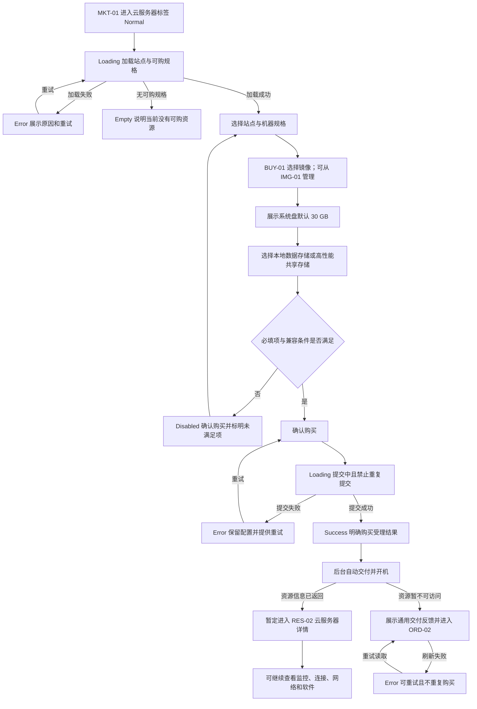
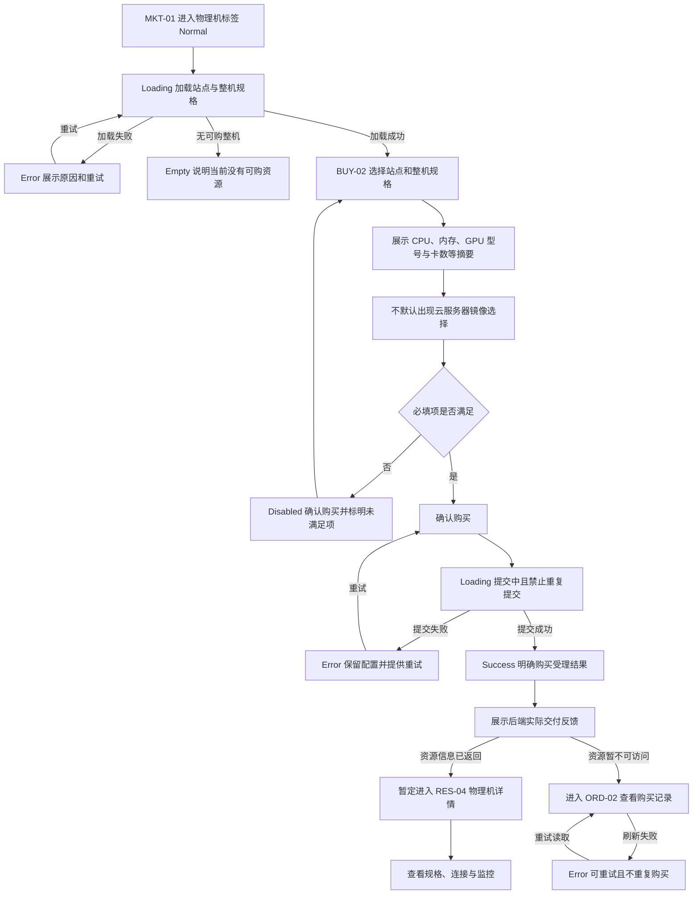
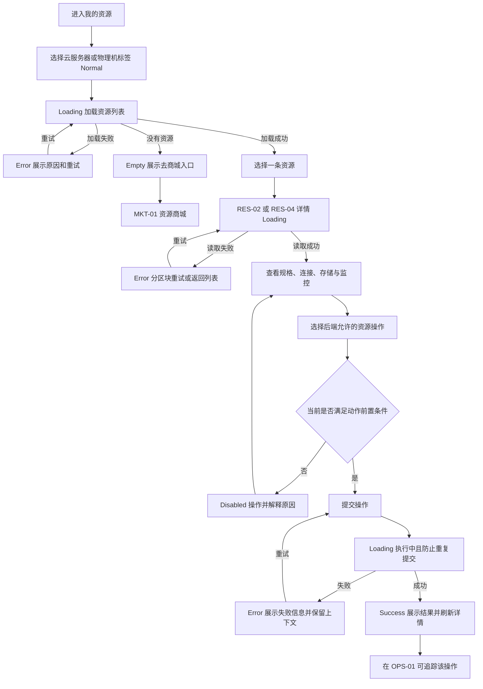
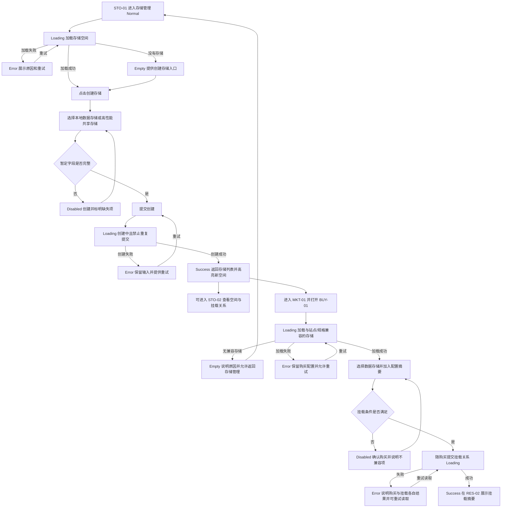
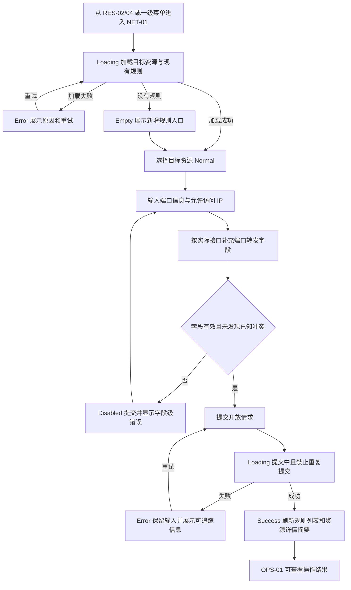
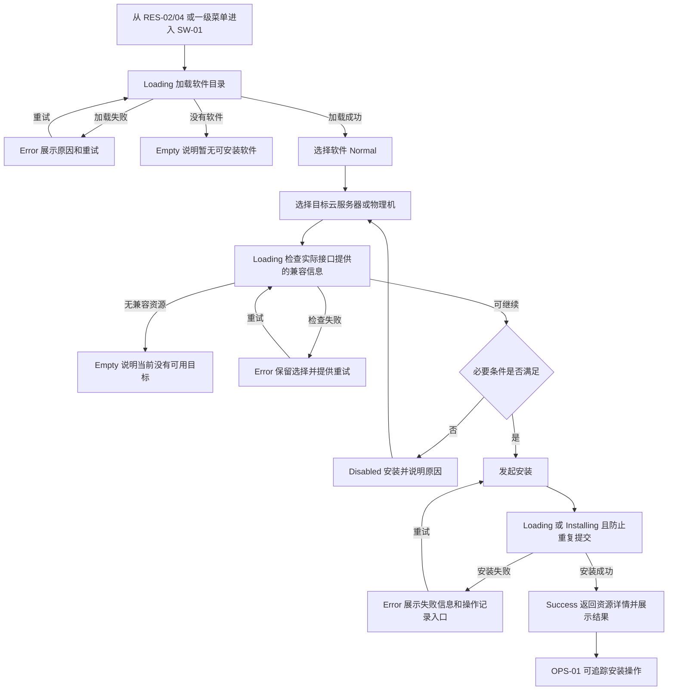
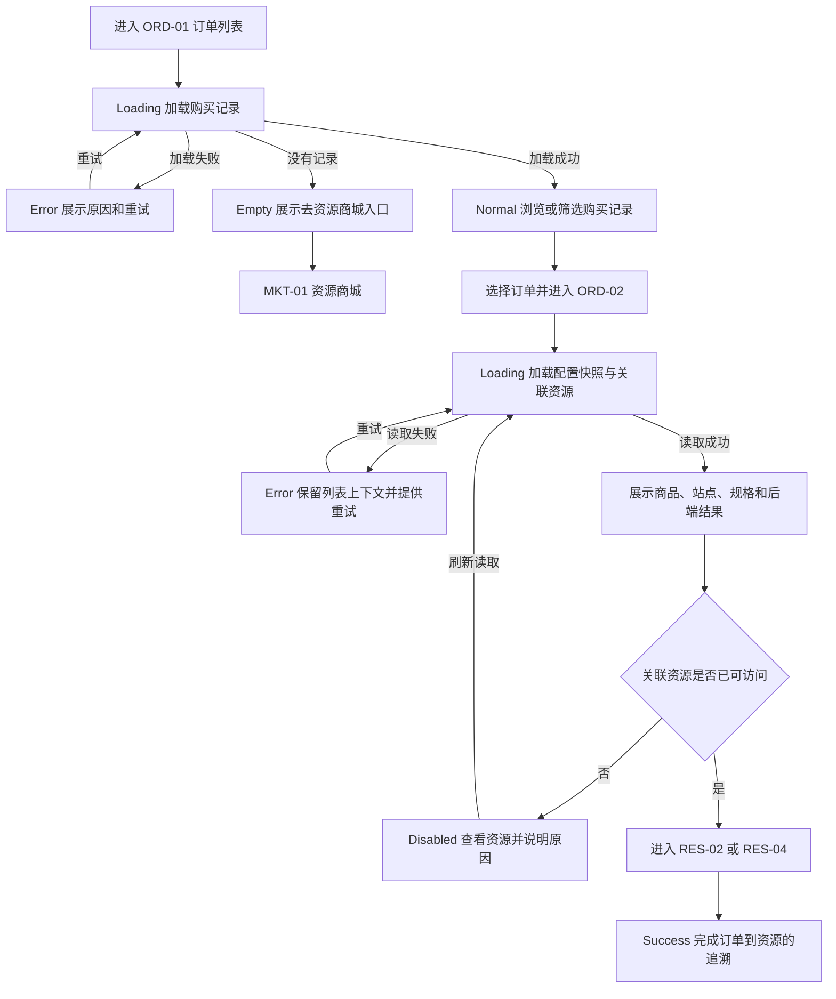
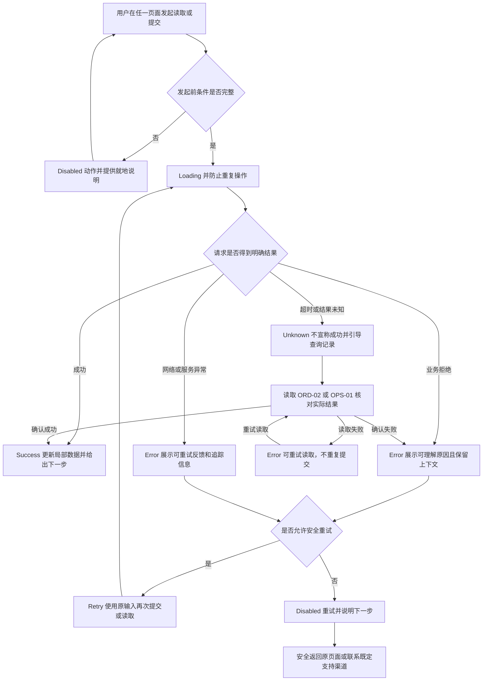
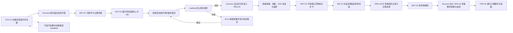

# 用户流程

> 文档状态：需求基线（实施前）
>
> 产品工作名：算力资源服务平台（非正式名称）
> 本文描述可交互原型必须覆盖的用户路径和界面反馈，不定义计费、审批、权限或后端资源/订单状态机。

## 1. 流程口径

### 1.1 已确认事实

- 商品分为云服务器和物理机；是否带 GPU 是规格属性。（会议 00:02:15，L89–92）
- 本产品直接交付机器，商城与购买后的资源管理分离。（会议 00:06:25–00:08:36，L281–397）
- 会中明确了购买后自动分配机器并直接开机的交付方向；本流程将其用于云服务器演示，适用资源类型、中间状态、耗时及物理机规则仍待确认。（会议 00:07:07，L299–301）
- 已购资源需要列表、详情、开关机等适用操作、连接信息和监控。（会议 00:07:07–00:09:28，L299–451）
- 存储空间独立管理，并在购买/启动资源时选择挂载。（会议 00:12:32–00:13:17，L593–631）
- 网络能力包括开放/转发端口和设置允许访问的 IP。（会议 00:13:23–00:13:46，L641–661）
- 提供软件目录并支持向机器安装软件；“一键安装”是会议建议，是否一键或预装仍待确认。（会议 00:15:06–00:15:17，L707–715）
- 系统盘保留且默认 30 GB；30 GB 不是内存。数据存储区分本地数据存储和高性能共享存储。（会后补充 L5–29）

### 1.2 暂定推进规则

- 购买成功后的首选落点暂定为对应资源详情；资源尚不可访问时展示通用交付反馈，并允许查看订单。该反馈不构成正式状态枚举。
- 不出现支付、余额、账期、续费、退款或审批步骤；“不按需”是唯一已确认的计费方向，不能据此推导具体计费流程。
- 资源、订单、安装和操作的正式状态名称、状态转换和时限均待确认。流程只使用界面级 `Loading / Success / Error / Disabled / Empty` 反馈。
- 物理机是否自动开机、是否选择操作系统、是否有交付等待阶段待确认；流程用中性的“交付反馈”承载。
- 数据存储流程以“先创建高性能共享存储，再在云服务器购买时选择挂载”为可演示路径。已运行资源能否热挂载、物理机是否适用均待确认。

### 1.3 流程索引

| 流程 ID | 流程名称 | 主入口 | 成功落点（暂定） |
|---|---|---|---|
| `FLOW-CLOUD-BUY` | 云服务器购买成功流程 | `MKT-01` | `RES-02`；资源未可用时 `ORD-02` |
| `FLOW-PHYSICAL-BUY` | 物理机购买成功流程 | `MKT-01` | `RES-04`；资源未可用时 `ORD-02` |
| `FLOW-RESOURCE-MANAGE` | 已购资源管理流程 | `RES-01`/`RES-03` | 对应资源详情和操作反馈 |
| `FLOW-STORAGE-MOUNT` | 存储空间创建与挂载流程 | `STO-01` | `BUY-01` 的配置摘要/`RES-02` |
| `FLOW-NETWORK-OPEN` | 网络端口开放流程 | `NET-01`/资源详情 | `NET-01` 规则列表与资源详情摘要 |
| `FLOW-SOFTWARE-INSTALL` | 软件安装流程 | `SW-01`/资源详情 | 资源详情与 `OPS-01` |
| `FLOW-ORDER-VIEW` | 订单查看流程 | `ORD-01` | `ORD-02`/关联资源详情 |
| `FLOW-FAILURE` | 操作失败和异常流程 | 任一可提交操作 | 原上下文、操作记录或安全返回页 |
| `FLOW-DEMO` | 领导演示推荐流程 | `STO-01` | 云服务器完整链路后补充物理机链路 |

## 2. `FLOW-CLOUD-BUY` 云服务器购买成功流程

关键约束：

1. 系统盘与内存必须分区展示；`30 GB` 只标注为系统盘默认容量。
2. 系统盘是否可编辑及范围未确认；原型可暂以只读值展示，不做业务校验推断。
3. “无卡”不作为已确认筛选项；无 GPU 的云服务器仍可作为普通规格展示。
4. 购买提交成功不等于自创某个正式订单状态；只展示后端返回的结果文案。
5. 提交失败必须保留已选配置，重试不得生成未经用户确认的第二次购买。

## 3. `FLOW-PHYSICAL-BUY` 物理机购买成功流程

关键约束：

1. 会中明确物理机不需要提供镜像，但同一段转写对操作系统表述含混；本流程不把“选择/不选择操作系统”写死。
2. 物理机是否自动开机、何时分配 IP、能否选择数据存储均待确认。
3. 成功反馈可演示“已受理/已交付”等中性结果，但不得据此定义订单或资源状态枚举。

## 4. `FLOW-RESOURCE-MANAGE` 已购资源管理流程

适用动作基线：

- 云服务器至少有开机、关机、查看连接信息、监控、网络和安装软件入口。
- 物理机需要同类管理和监控，但具体电源操作集合待确认；未确认动作必须隐藏或禁用并说明原因。
- 页面仅展示后端返回的当前状态；不得在前端自行推导正式状态或实现未确认的状态转换。
- SSH 以连接信息为基线，不据此新增浏览器内终端。

## 5. `FLOW-STORAGE-MOUNT` 存储空间创建与挂载流程

关键约束：

1. “创建存储”是为满足指定流程而采用的推断需求；创建字段、配额和站点兼容规则待确认。
2. 用户文案暂用“本地数据存储/高性能共享存储”；HostPath/NFS 是底层映射，是否外露待确认。
3. 系统盘不进入数据存储选择列表；它在 `BUY-01` 单独展示。
4. 已运行资源能否挂载/解除挂载、失败是否回滚购买、物理机是否支持挂载均待确认，本流程不定义。

## 6. `FLOW-NETWORK-OPEN` 网络端口开放流程

关键约束：

- 已确认的业务信息只有目标机器、暴露端口/转发关系和允许访问 IP；协议、内外端口、CIDR 格式、规则上限与冲突检测均待确认。
- 原型可以显示暂定字段，但必须标注为样例，不得据此建立后端校验规则。
- 当前基线暂不纳入复杂 VPC/VDC；该范围边界仍需产品确认。

## 7. `FLOW-SOFTWARE-INSTALL` 软件安装流程

关键约束：

- 软件安装能力已确认；一键安装、购买时预装还是交付后安装、是否需要版本和参数均待确认。
- 不默认加入升级、卸载、许可证、依赖处理或付费软件规则。
- 安装失败不得假装资源已安装；刷新后仍以统一数据源为准。

## 8. `FLOW-ORDER-VIEW` 订单查看流程

关键约束：

- 订单页面记录购买，不展示未经确认的价格、支付、余额、账期、续费、退款、审批或账单字段。
- 订单状态名称与转换尚未确认；页面只显示后端实际返回的结果文案。
- 读取失败的“重试”只重新读取，不重复提交购买。

## 9. `FLOW-FAILURE` 操作失败和异常流程

### 9.1 统一异常处理约束

1. **读取失败**：保留页面框架和已有数据，错误尽量局部化；提供重试和安全返回。
2. **校验失败**：就地标记字段，首个错误可定位；修正前提交按钮保持 Disabled。
3. **提交失败**：保留用户输入，不自动关闭弹窗，不自动重复提交。
4. **结果未知**：不得显示成功；优先读取订单或操作记录确认，避免重复购买、重复开端口或重复安装。
5. **部分成功**：分别展示各子操作结果。例如购买成功但挂载失败时，不把整个流程简单描述为“全部成功”；具体补偿/回滚策略待确认。
6. **空数据**：区分“确实没有数据”与“加载失败”；Empty 必须提供与场景一致的下一步。
7. **不可操作**：Disabled 状态必须说明原因，不因权限推断隐藏动作；权限模型尚未确认。

## 10. `FLOW-DEMO` 领导演示推荐流程

推荐时长与讲解节奏待演示团队决定；以下顺序优先展示“从存储准备到机器可管理”的完整价值闭环。

### 10.1 建议演示脚本

1. 在 `STO-01` 创建一个高性能共享存储，强调它与系统盘分离；创建字段使用演示数据，不宣称正式配额规则。
2. 在 `MKT-01` 切换云服务器标签，选择一个带 GPU 的规格；说明产品也允许不带 GPU 的计算节点，但不演示未经确认的“无卡”筛选。
3. 进入 `BUY-01`，明确展示内存与“系统盘 30 GB”是两个字段，并选择刚创建的高性能共享存储。
4. 提交购买，展示 Loading、防重复提交和 Success；成功后暂定进入 `RES-02`。
5. 在详情展示站点、规格、挂载、SSH 信息和监控，不演示浏览器内 SSH 终端。
6. 进入 `NET-01`，配置一个演示端口和允许访问 IP；协议、内外端口字段使用接口确认后的版本。
7. 进入 `SW-01` 发起软件安装；只说明“支持安装”，不把一键/预装方式说成已拍板。
8. 在 `ORD-01/02` 展示购买记录和关联资源，不展示价格或账单。
9. 返回商城购买物理机，在 `RES-04` 展示整机规格、连接和监控；不演示未经确认的镜像/操作系统选择或自动开机承诺。
10. 以 `OPS-01` 收束，展示端口、安装等操作有明确结果；如需展示失败，使用可恢复的演示数据，不破坏主路径。

### 10.2 演示保障

- 每个关键提交点准备 Success、Error 和 Disabled 三组可切换 Mock 状态；本阶段只定义状态，不编写 Mock 代码。
- 领导演示默认走 Success 主路径；Error 仅作为产品完整性补充，不依赖现场真实故障。
- 任一接口样例没有返回结果时，使用“结果未知，正在核对记录”的安全反馈，不能伪造成功。
- 演示文案使用可配置产品工作名，不使用 OneAiNexus 作为最终产品名称。

## 11. 跨流程一致性规则

1. 同一资源的站点、规格、存储、连接和关联订单在商城摘要、购买配置、资源详情和订单详情中必须一致。
2. 同一存储空间的展示类型在 `STO-01/02`、`BUY-01` 和 `RES-02` 中保持一致；不得把高性能共享存储显示成本地存储。
3. 提交中的动作必须禁用重复提交；刷新或返回后以统一数据源结果为准。
4. 资源详情、订单详情和操作记录之间使用同一关联标识；标识字段的正式名称待接口确认。
5. 所有失败反馈至少包含可理解原因、是否可重试、下一步和可用时的追踪信息。
6. 所有待确认业务状态只作为样例展示，不写进前端分支、后端校验或验收中的“已确认规则”。
