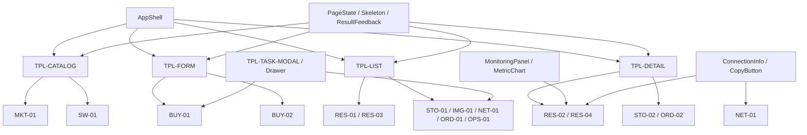

# 页面与组件映射

> 用途：把信息架构中的稳定页面 ID 映射到统一布局、公共组件、业务组件和状态，供后续原型及工程任务直接引用。
>
> 业务依据：[需求基线](./01-requirements-baseline.md)与[信息架构](./04-information-architecture.md)。
>
> 视觉依据：[UI 规范提取](./07-ui-spec-extraction.md)。
> 约束：表中“新增规范外组件”只是为承载已确认业务和完整交互所需的表现组件，不新增计费、审批、权限或状态机规则。

## 1. 组件分层

| 层级 | 定义 | 示例 | 复用要求 |
|---|---|---|---|
| 应用框架 | 所有登录后页面共享的壳层 | 顶栏、展开/收起侧栏、主内容容器、页面标题栏 | 全局唯一实现，尺寸遵循 PDF p.4-p.7 |
| 公共基础组件 | 不含业务语义、由 UI 规范直接覆盖的组件 | Button、Input、Textarea、Radio、Checkbox、Select、Modal、Tabs、Tooltip、Table、Pagination、Form | 统一 Design Token 与状态，不允许页面私有复制 |
| 公共扩展组件 | 产品必须具备但 PDF 未完整提供的通用组件 | Drawer、Loading、Skeleton、Empty、Error、Toast/Notification、Result、StatusBadge、CopyButton | 先定义统一规范，再供所有页面使用；不得各页自行画法 |
| 业务组件 | 组合公共组件以表达算力资源领域信息 | 资源规格卡、购买配置摘要、监控面板、连接信息、存储挂载选择器、端口规则编辑器 | 按业务对象复用；组件只展示已确认字段，待确认字段必须显式标记 |

## 2. 共享应用框架

所有页面默认使用 `AppShell`：

- `TopNavbar`：高 56 px；左侧品牌区宽 208 px；品牌内容可配置，不硬编码 OneAiNexus。（PDF p.4）
- `SideNavigation`：展开 208 px、收起 64 px；选中项圆角 8 px；收起态图标配 Tooltip。（PDF p.5）
- `MainContent`：与壳层留 8 px 外间隙、圆角 8 px、自适应剩余空间。（PDF p.6）
- `PageTitleBar`：高 64 px、左右内边距 20 px、右侧操作间距 8 px。（PDF p.7）
- `ContentGrid`：1080p 基准内容宽 1704 px、24 栏、边距/栏距均为 20 px。（PDF p.16）
- `FloatingAction`：若使用，距主内容右、下各 20 px；业务用途尚未确认，只预留组件能力，正式页面默认不显示。（PDF p.7）

## 3. 布局模板

| 模板 ID | 名称 | 结构 | 适用页面 | UI 依据 |
|---|---|---|---|---|
| `TPL-CATALOG` | 目录/卡片模板 | 页面标题栏 → 标题栏 Tab/筛选 → 24 栏卡片区 → 分页/页面状态 | `MKT-01`、`SW-01` | p.7、p.9、p.12、p.14、p.16、p.17 |
| `TPL-FORM` | 配置表单模板 | 页面标题栏 → 栅格化分段表单 → 右侧锚点 → 底部操作区；上传区域可按 p.18 使用 800 px 明确宽度 | `BUY-01`、`BUY-02` | p.10-p.13、p.16、p.18 |
| `TPL-LIST` | 列表管理模板 | 页面标题栏 → Tabs/搜索/筛选/主操作 → 表格 → 分页 | `RES-01`、`RES-03`、`STO-01`、`IMG-01`、`NET-01`、`ORD-01`、`OPS-01` | p.7、p.9-p.12、p.14、p.17 |
| `TPL-DETAIL` | 对象详情模板 | 页面标题栏 → 对象摘要 → 下划线 Tabs/锚点 → 分区容器 | `RES-02`、`RES-04`、`STO-02`、`ORD-02` | p.7、p.8、p.14、p.16、p.18 |
| `TPL-TASK-MODAL` | 轻量任务模板 | 普通弹窗/抽屉 → 表单 → 确认/取消 → 结果反馈 | 创建存储、上传镜像、安装软件、开放端口等 | p.10-p.13、p.18；Drawer/结果反馈为规范外扩展 |

## 4. 页面与组件总映射

状态简写：`L` Loading、`E` Empty、`F` Error/Failure、`D` Disabled、`S` Success、`N` No-result、`P` Processing。这里描述的是界面反馈状态，不是后台正式业务状态枚举。

| 页面 ID / 页面 | 布局模板 | 公共组件 | 业务组件 | 核心交互 | 必须覆盖的状态 | 规范外组件与依据 |
|---|---|---|---|---|---|---|
| `MKT-01` 资源商城 | `TPL-CATALOG`；云服务器/物理机标题栏 Tab | TitleBarTabs、SearchInput、Select、MultiSelect、FilterTag、Button、Container、Grid、Pagination、Tooltip | `MarketplaceFilters`、`MarketplaceResults`、`MarketplaceStatePanel`、`ResourceProductCard` | 切换商品类型；搜索/组合筛选/清空；查看规格；进入 `BUY-01/02` | `L/E/N/F/D`；规格不可用时禁用配置并说明；筛选切换有反馈；错误可重试 | **需要**：资源规格卡和页面状态组合。依据：两类商品及带卡信息 `REQ-002/003/016`、列表状态 `INF-001/002`；PDF 无资源卡与页面状态 |
| `BUY-01` 云服务器购买配置 | `TPL-FORM`；分段表单 + 右侧锚点 + 底部确认 | Form、Select、Radio/Card Radio、Checkbox、Input、Tooltip、Container、Button、Modal | `CloudSpecSelector`、`ImageSelector`、`SystemDiskField`、`StorageMountSelector`、`PurchaseSummary` | 选站点/规格/镜像；明确区分内存与系统盘；显示系统盘暂定 30 GB；选择本地/高性能共享存储；提交、取消、返回 | 表单 Normal/Hover/Focus/Error/D；依赖项加载 `L/F/E`；提交 `P/S/F`；不兼容项 D 并解释；保留失败前输入 | **需要**：规格选择卡、存储挂载选择器、购买摘要、提交结果、Toast。依据：`REQ-013/015/021-027`；PDF 无领域组合与异步反馈 |
| `BUY-02` 物理机购买配置 | `TPL-FORM`；整机规格为主，待确认项不固化 | Form、Select、Radio/Card Radio、Tooltip、Container、Button、Modal | `PhysicalSpecSelector`、`AcceleratorCountSelector`、`PurchaseSummary`、`PendingDecisionNotice` | 选站点、整机规格、卡型/卡数；提交、取消、返回；不默认套用云服务器镜像/系统盘规则 | `L/E/F/D/P/S`；待确认字段以说明态展示；规格不可用与提交失败可恢复 | **需要**：整机规格卡、待确认提示、结果反馈。依据：`REQ-016` 与物理机 OS/镜像冲突 `CON-006`；防止把假设做成规则 |
| `RES-01` 云服务器列表 | `TPL-LIST`；“我的资源”云服务器 Tab | Tabs、Search Input、Select、Button、Table、Pagination、Tooltip、Checkbox（若批量能力确认） | `ResourceStatusBadge`、`ResourceSpecCell`、`QuickActionMenu` | 搜索/筛选；进入 `RES-02`；发起适用的开机/关机；复制基础连接信息（若列表提供） | 首次 `L`、`E`、`N`、`F`；操作 `P/S/F/D`；分页加载；状态不明时不展示推断操作 | **需要**：状态标识、行操作菜单、异步操作反馈、骨架/错误。依据：`REQ-007/009`；PDF 无状态标识与 Loading |
| `RES-02` 云服务器详情 | `TPL-DETAIL`；摘要 + 详情分区/下划线 Tabs | Container、Tabs、Button、Tooltip、Table、Modal、Form | `ResourceSummary`、`ConnectionInfo`、`MonitoringPanel`、`MetricChart`、`StorageMountSummary`、`NetworkRuleSummary`、`SoftwareInstallSummary`、`RelatedOrderLink` | 查看规格/站点/系统盘/存储；复制 IP/SSH 信息；查看监控；发起开关机；跳转存储/网络/软件/订单 | 页面 `L/F`；监控 `L/E/F`；复制 `S`；各异步操作 `P/S/F/D`；关联对象缺失；无监控数据不等于加载失败 | **需要**：资源摘要、连接信息、监控图表、状态标识、复制反馈、异步结果。依据：`REQ-009-014/017/018/021-027`；PDF 无图表、复制与业务状态组件 |
| `RES-03` 物理机列表 | `TPL-LIST`；“我的资源”物理机 Tab | Tabs、Search Input、Select、Button、Table、Pagination、Tooltip | `ResourceStatusBadge`、`PhysicalSpecCell`、`QuickActionMenu` | 搜索/筛选；进入 `RES-04`；发起已确认适用操作；不得假设物理机与云服务器操作完全相同 | `L/E/N/F/P/S/D`；不可用操作说明；交付状态名称保持可替换 | **需要**：状态标识、整机规格单元格、异步反馈。依据：物理机需管理与监控 `REQ-008/010`，具体动作集合待确认 |
| `RES-04` 物理机详情 | `TPL-DETAIL`；摘要 + 分区/下划线 Tabs | Container、Tabs、Button、Tooltip、Table、Modal、Form | `PhysicalResourceSummary`、`ConnectionInfo`、`MonitoringPanel`、`MetricChart`、`NetworkRuleSummary`、`SoftwareInstallSummary`、`PendingDecisionNotice` | 查看整机规格、IP/连接、CPU/内存/加速卡监控；进入网络/软件/订单；只显示已确认适用操作 | 页面 `L/F`；监控 `L/E/F`；复制 `S`；操作 `P/S/F/D`；OS/镜像/存储适用性待确认提示 | **需要**：物理机摘要、监控图表、连接信息、待确认提示。依据：`REQ-008/010/011/016/017`；PDF 无领域详情与图表 |
| `STO-01` 存储空间列表 | `TPL-LIST`；主操作“创建存储空间”打开任务弹窗 | Search Input、Select、Button、Table、Pagination、Modal、Form、Tooltip | `StorageTypeBadge`、`MountCountCell`、`CreateStorageForm`、`StorageCompatibilityHint` | 搜索/筛选；区分本地数据存储与高性能共享存储；创建；进入 `STO-02` | `L/E/N/F`；创建表单 Error/D；提交 `P/S/F`；站点/类型不兼容 D 并说明 | **需要**：存储类型标识、创建表单、结果反馈。依据：`REQ-012/021-027`；PDF 无存储语义组件 |
| `STO-02` 存储空间详情 | `TPL-DETAIL`；摘要 + 挂载关系列表 | Container、Tabs/锚点、Button、Table、Pagination、Modal、Tooltip | `StorageSummary`、`MountRelationTable`、`StorageTypeBadge`、`CompatibilityNotice` | 查看类型、站点和挂载关系；从关联资源返回；购后挂载/解绑仅在规则确认后开放 | 页面 `L/F`；挂载关系 `L/E/F`；关联资源缺失；操作若未确认则 D/不展示 | **需要**：存储摘要、挂载关系、兼容提示。依据：存储独立管理 `REQ-012/026/027`；文件浏览器不在当前确认范围 |
| `IMG-01` 镜像管理 | `TPL-LIST`；上传入口使用任务弹窗/抽屉 | Search Input、Select、Button、Table、Pagination、Modal、Form、Tooltip | `ImageCompatibilityBadge`、`UploadImageForm`、`UploadProgress`、`ImageSourceLabel` | 搜索/筛选；打开上传；校验表单；上传并查看结果；作为 `BUY-01` 的关联入口 | `L/E/N/F`；上传校验 Error/D；上传 `P/S/F`；兼容性未知或不兼容提示 | **需要**：Drawer（如采用）、上传进度、兼容性标识、结果反馈。依据：镜像上传与创建选择 `REQ-015`；PDF 仅给上传区域，无进度/兼容性 |
| `SW-01` 软件中心 | `TPL-CATALOG`；软件卡片 + 安装任务弹窗 | Search Input、Select、筛选标签、Button、Container、Pagination、Modal、Form、Tooltip | `SoftwareCard`、`CompatibilityBadge`、`TargetResourceSelector`、`InstallTaskSummary` | 搜索/筛选；查看软件信息；选择目标资源；发起安装；跳转资源/操作记录 | `L/E/N/F`；目标资源加载 `L/E/F`；不兼容 D；安装 `P/S/F`；版本/卸载规则不擅自出现 | **需要**：软件卡、兼容性标识、安装任务反馈。依据：软件安装 `REQ-017`；PDF 无软件目录与安装进度 |
| `NET-01` 网络与访问 | `TPL-LIST`；资源关联规则表 + 新建/编辑弹窗 | Search Input、Select、Button、Table、Pagination、Modal、Form、Input、Tooltip | `PortRuleEditor`、`IpAllowlistEditor`、`ResourceSelector`、`ConnectionInfo`、`RuleStatusBadge` | 按资源筛选；查看端口暴露/转发/允许 IP；新建/编辑已确认字段；复制连接信息 | `L/E/N/F`；字段 Normal/Focus/Error/D；提交 `P/S/F`；冲突/非法格式 Error；协议等未确认项不固化 | **需要**：端口规则编辑器、IP 列表编辑器、复制反馈、状态标识。依据：`REQ-014`；PDF 无网络字段组合 |
| `ORD-01` 订单列表 | `TPL-LIST`；不展示未经确认的价格/支付字段 | Search Input、Select、Tabs（如订单/记录同壳）、Table、Pagination、Tooltip | `OrderStatusBadge`、`ResourceLinkCell`、`PurchaseSnapshotCell` | 搜索/筛选；进入 `ORD-02`；跳转关联资源 | `L/E/N/F`；关联资源缺失；状态枚举未确认时使用可替换展示，不增加金额/支付态 | **需要**：订单状态标识、关联资源单元格。依据：购买记录方向 `REQ-018`；正式状态与金额口径待确认 |
| `ORD-02` 订单详情 | `TPL-DETAIL`；购买快照 + 关联资源 | Container、Tabs/锚点、Button、Table、Tooltip | `OrderSummary`、`PurchaseSnapshot`、`RelatedResourceCard`、`PendingDecisionNotice` | 查看购买快照；进入关联资源；返回列表并保留上下文 | 页面 `L/F`；关联资源 `L/E/F`；无金额/账单字段；未知订单状态不推断 | **需要**：购买快照、关联资源卡、待确认提示。依据：`REQ-018` 与订单/账单冲突 `CON-007` |
| `OPS-01` 操作记录 | `TPL-LIST`；跨资源操作结果列表 | Search Input、Select、Table、Pagination、Tooltip、Modal（查看失败详情） | `OperationResultBadge`、`OperationTargetLink`、`FailureDetailPanel` | 搜索/筛选；查看操作对象和结果；进入关联资源；查看失败原因并按允许方式重试 | `L/E/N/F`；单条操作 `P/S/F`；关联对象缺失；重试按钮 D 时说明原因 | **需要**：操作结果标识、失败详情、统一重试反馈。依据：完整管理与异常闭环的推断需求 `INF-004/008`；不定义后台状态机 |

## 5. 业务组件定义与边界

### 5.1 资源发现与购买

| 组件 | 最小职责 | 可使用字段 | 禁止承载 | 页面 |
|---|---|---|---|---|
| `ResourceProductCard` | 比较可购资源并进入配置 | 商品类型、站点、CPU、内存、加速卡型号/数量、可用性说明 | 开关机、SSH、监控；未经确认的价格/计费周期 | `MKT-01` |
| `MarketplaceFilters` | 组合搜索、站点、计算类型、配置状态和条件式加速卡筛选；回显并移除当前条件 | 目录派生的站点/加速卡选项、搜索文字、界面级配置状态 | “无卡”GPU 型号；正式库存/上下架规则；页面私有复制公共控件 | `MKT-01` |
| `MarketplaceResults` | 展示筛选后数量，编排三列规格卡、分页和页面状态 | 当前资源类型、查询结果、页面级 Loading/Error/Empty/No Result | 订单提交、资源交付或把界面态命名为后台状态 | `MKT-01` |
| `MarketplaceStatePanel` | 在结果上下文内统一呈现 Loading、Error、Empty、No Result 及对应下一步 | 中性标题、说明、重试/清除搜索/重置/切换类型操作 | 后台错误码、库存状态机；用同一文案混淆空目录和筛选无结果 | `MKT-01` |
| `CloudSpecSelector` | 选择云服务器规格 | CPU、内存、加速卡信息、站点可用性 | 把系统盘写成内存；暗含库存/锁定规则 | `BUY-01` |
| `PhysicalSpecSelector` | 选择整机规格 | CPU、内存、加速卡型号/卡数、站点 | 默认镜像、系统盘或自动开机规则 | `BUY-02` |
| `SystemDiskField` | 显示系统盘配置 | 标签“系统盘”、暂定默认 `30 GB`、是否可编辑的待确认说明 | K8S Pod 底层术语；将 30 GB 表达为内存 | `BUY-01` |
| `StorageMountSelector` | 选择已有数据存储 | 本地数据存储/高性能共享存储、名称、站点兼容性 | 将 HostPath/NFS 默认作为主标签；擅自定义多挂载/解绑规则 | `BUY-01`，物理机适用性确认后可复用 |
| `PurchaseSummary` | 提交前复述用户选择 | 已选择的可确认字段 | 金额、支付、续费、审批、正式订单状态 | `BUY-01/02` |

`MKT-01` 状态组合覆盖：

| 状态 | 判定边界 | 反馈与恢复 |
|---|---|---|
| Normal | 当前类型目录和筛选结果均有数据 | 显示数量、规格卡和适用时的分页 |
| Loading (`L`) | 本地演示数据读取中 | 保留筛选上下文，结果区显示克制加载反馈 |
| Error (`F`) | 数据读取失败 | 可见错误说明和真实重试操作 |
| Empty (`E`) | 当前资源类型目录总数为 0 | 说明该类型暂无资源并提供切换类型入口 |
| No Result (`N`) | 目录有数据但组合条件结果为 0 | 清除搜索和/或重置筛选，不与 Empty 共用文案 |
| Disabled (`D`) | 单个规格演示为暂不可配置 | 卡片仍可比较；按钮禁用；可见原因与 Tooltip/ARIA 说明 |

以上均为页面反馈状态，不是正式库存、资源、订单或交付状态枚举。

### 5.2 资源管理与监控

| 组件 | 最小职责 | 必须状态 | 业务边界 | 页面 |
|---|---|---|---|---|
| `ResourceStatusBadge` | 视觉化显示后端返回的资源状态 | Normal、语义色、未知状态兜底 | 状态枚举和流转由产品/后端确认；组件不自行命名 | `RES-01/03`、详情摘要 |
| `ResourceSummary` | 展示资源身份、站点和规格摘要 | Loading、Error、正常、字段缺失 | 不把商品发现/购买比较塞入详情 | `RES-02/04` |
| `ConnectionInfo` | 展示和复制 IP、端口、SSH 等连接信息 | Loading、Unavailable、Copy Success/Failure | 不等同于浏览器内置 SSH 终端；凭证规则待确认 | `RES-02/04`、`NET-01` |
| `MonitoringPanel` | 组织监控指标、时间范围和图表状态 | Loading、Empty、Error、正常 | 指标口径、刷新频率、告警阈值保持待确认 | `RES-02/04` |
| `MetricChart` | 展示 CPU/内存/加速卡等时序数据 | Loading、Empty、Error、Hover/Tooltip | PDF 没有图表规范；不得用静态图片代替 | `RES-02/04` |
| `QuickActionMenu` | 收纳适用于当前资源的管理动作 | Normal、Disabled reason、Processing | 不推断物理机与云服务器具有相同动作矩阵 | `RES-01/03`、详情 |

### 5.3 存储、镜像、软件和网络

| 组件 | 最小职责 | 关键状态 | 边界 | 页面 |
|---|---|---|---|---|
| `StorageTypeBadge` | 区分本地数据存储与高性能共享存储 | 两类明确视觉；未知类型兜底 | 技术术语是否显示待确认 | `STO-01/02`、购买/资源详情 |
| `MountRelationTable` | 展示存储与资源关联 | Loading、Empty、Error、关联对象缺失 | 购后挂载/解绑规则未确认，不据此提供按钮 | `STO-02` |
| `UploadImageForm` | 收集镜像上传所需已确认信息 | Normal、Error、Disabled、Uploading、Success、Failure | 格式、大小、审核、版本未确认时仅放可替换占位字段 | `IMG-01` |
| `CompatibilityBadge` | 表达站点/资源兼容结果 | Compatible、Incompatible、Unknown | 兼容矩阵必须来自数据，不由前端推断 | `IMG-01`、`SW-01` |
| `SoftwareCard` | 展示可安装软件/环境并进入安装 | Loading、Disabled reason、Selected | 不自动增加版本、升级、卸载、预装规则 | `SW-01` |
| `PortRuleEditor` | 组合端口暴露/转发与来源 IP 字段 | Default、Focus、Validation Error、Submitting、Failure | 协议、范围、审批、安全限制待确认 | `NET-01` |

### 5.4 订单与操作记录

| 组件 | 最小职责 | 关键状态 | 边界 | 页面 |
|---|---|---|---|---|
| `PurchaseSnapshot` | 复述购买时已确认配置 | Loading、字段缺失、正常 | 不展示未经确认的金额/支付/账期 | `ORD-01/02` |
| `OrderStatusBadge` | 显示接口返回的订单状态 | Known、Unknown | 不自行建立订单状态机 | `ORD-01/02` |
| `OperationResultBadge` | 显示动作处理/结果 | Processing、Success、Failure、Unknown | 只作界面语义，不定义后端任务流转 | `OPS-01` |
| `FailureDetailPanel` | 展示可理解的失败原因和可用下一步 | Loading、Detail、Unavailable | 不泄露 K8S Pod/内部错误；重试条件由业务确认 | `OPS-01` 及各操作反馈 |

## 6. 必须新增的规范外公共组件

| 组件 | 为什么必须新增 | 最小变体/状态 | 设计依据 |
|---|---|---|---|
| `PageState` | PDF 只给表格空状态，产品所有页面都需要统一反馈 | Loading、Empty、NoResult、Error、Unavailable；含重试或下一步 | 原型验收要求；沿用 p.8 容器、p.9 按钮、p.17 空状态；权限模型未确认，不设专用权限变体 |
| `Skeleton` / `Spinner` | 防止异步加载无反馈及布局跳动 | Page、Table、Card、Detail、Inline | PDF 缺失；尺寸/颜色应基于中性色与原组件骨架 |
| `Toast` / `Notification` | 复制、提交、开关机等动作需要即时结果 | Info、Success、Warning、Error、Loading | 功能色取 p.2；容器取 p.8；行为规范需新增 |
| `ResultFeedback` | 购买、创建、上传、安装等任务需明确成功/失败和去向 | Processing、Success、Failure、Partial/Unknown（仅后端提供时） | p.13 提示弹窗可作为视觉起点，正式状态不由组件定义 |
| `Drawer` | 上传、安装、网络规则等较长轻量任务可能不适合小弹窗 | 默认、Loading、Error、Unsaved-change confirm | PDF 未提供；沿用 p.13 Head/Content/Footer 和 p.18 表单间距 |
| `StatusBadge` | 资源、订单、操作结果需紧凑表达状态 | Neutral、Info、Success、Warning、Error、Unknown | 颜色取 p.2；具体枚举由业务数据提供 |
| `CopyButton` | IP/端口/SSH 信息需要复制反馈 | Normal、Hover、Focus、Copied、Failure、Disabled | 按钮取 p.9、Tooltip 取 p.15；Copied/Failure 为扩展 |
| `MetricChart` | 已确认资源监控无法由表格替代 | Loading、Empty、Error、Normal、Hover Tooltip | 色彩/字体/Tooltip 取 p.2、p.3、p.15；图表轴线/曲线规范待设计 |
| `Progress` | 上传镜像、安装软件、异步交付需要过程反馈 | Indeterminate、Determinate（仅有数据时）、Success、Failure | PDF 缺失；不得虚构百分比 |
| `PendingDecisionNotice` | 防止将待确认项实现成确定规则 | Inline、Section、Blocking | 使用 p.8 信息/注意容器；文案明确“暂定/待确认” |

## 7. 公共组件状态覆盖要求

| 页面类型 | Loading | Empty | Error | Disabled | Success | 额外要求 |
|---|---|---|---|---|---|---|
| 目录/卡片页 | 页面或卡片骨架 | 首次空、筛选无结果分开 | 页面加载失败可重试 | 不可购/不兼容说明 | 筛选与进入配置有反馈 | 卡片尺寸在不同状态下保持稳定 |
| 列表页 | 表格骨架/局部 Loading | 数据空、筛选无结果分开 | 表格失败保留页面标题与筛选 | 行操作禁用原因 | 行操作成功同步更新 | 分页与筛选上下文不因失败丢失 |
| 详情页 | 摘要与各分区可独立加载 | 监控/关联对象各自空态 | 页面级与分区级错误分开 | 操作按实际条件禁用 | 复制/操作成功明确反馈 | 不把“暂无数据”误判为资源异常 |
| 表单页 | 依赖选项局部加载、提交中 | 选择器无选项 | 字段错误 + 提交失败 | 缺必填、依赖不兼容、提交中 | 成功反馈后再导航 | 失败保留已填内容，取消防误丢失 |
| 弹窗/抽屉 | 内容或提交 Loading | 依赖列表为空 | 字段/任务失败 | 确认按钮禁用原因 | 成功关闭并刷新来源页 | Focus 不逃逸，关闭策略待实现规范补齐 |

## 8. 跨页面组件复用关系

## 9. 实施顺序与组件闸门

1. 先实现 Design Token、`AppShell` 和 PDF 已定义的基础组件，再创建业务页面。
2. 在第一个异步页面前完成 `PageState`、`Skeleton`、`Toast/Notification`、`ResultFeedback`；不得用临时页面私有样式代替。
3. 在商城前完成 `ResourceProductCard` 和规格摘要；在购买页前完成规格选择、存储挂载选择和购买摘要。
4. 在资源详情前完成 `StatusBadge`、`ConnectionInfo`、`CopyButton`、`MonitoringPanel/MetricChart`。
5. 在镜像/软件/网络任务前统一 Modal/Drawer 的表单、提交和结果反馈模式。
6. 任何新增业务状态、字段或操作必须先回到决策日志/待确认问题更新；组件映射不能成为创造业务规则的入口。

## 10. 页面级验收要点

- 15 个稳定页面 ID 都有且仅有一个主布局模板，没有孤岛页面。
- `MKT-01 → BUY-01/02 → RES-02/04` 的主路径复用同一套提交和结果反馈。
- 云服务器和物理机共享布局与基础组件，但不强迫共享未经确认的镜像、系统盘、存储和操作字段。
- `30 GB` 只出现在 `SystemDiskField`/相关快照的系统盘语义中，绝不作为内存值。
- 本地数据存储与高性能共享存储在购买、存储列表、详情和资源详情中使用同一类型标识和文案。
- 所有列表页都覆盖 Loading、Empty、NoResult、Error；所有提交都覆盖 Processing、Success、Failure、Disabled。
- 规范外组件有统一 Token、状态和复用范围；不以截图、绝对定位或无反馈按钮补齐页面。
- OneAiNexus Logo/名称只作为 UI 来源说明，不进入任何业务组件默认内容。
