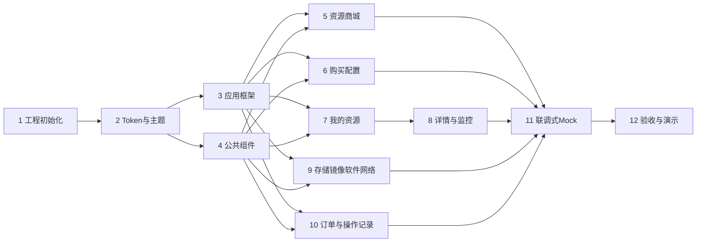

# 原型分阶段实施计划

> 2026-07-24 增补：Task 15 已将单一主状态、统一订单/账单、收银台和价格快照列为跨阶段基础设施。所有后续阶段必须复用该体系，不得恢复申请型购买流程。

## 文档定位

本计划用于把需求基线拆成可独立派发给 Codex 的后续工程任务。当前阶段只创建计划，不执行工程初始化、不安装依赖、不生成页面或 Mock 代码。

默认技术建议为 React + TypeScript + Vite，不锁定具体版本；正式执行阶段应先确认团队技术栈要求并使用当时稳定、相互兼容的版本。UI 必须由 Design Token 和公共组件驱动，不以截图或大量绝对定位还原。

## 共同输入与交付约束

所有工程阶段开始前必须读取：

1. [需求基线](./01-requirements-baseline.md)
2. [决策记录](./02-decision-log.md)
3. [待确认问题](./03-open-questions.md)
4. [信息架构](./04-information-architecture.md)
5. [页面清单](./05-page-inventory.md)
6. [用户流程](./06-user-flows.md)
7. [UI规范提取](./07-ui-spec-extraction.md)
8. [页面组件映射](./08-page-component-mapping.md)
9. [原型验收清单](./09-prototype-acceptance-checklist.md)

共同规则：

- 待确认项只能作为显式的临时假设，不得升级为正式业务规则。
- P0 问题不阻塞阶段 1–4；它们阻塞的是业务数据模型固化、核心业务页面定稿和正式接口契约。
- P0 问题关闭前，业务原型只能采用 `03-open-questions.md` 明确记录的可替换临时假设，且不得转成正式业务状态、后端校验、价格、审批或权限规则。
- 不得新增价格、支付、审批、权限、续费、退款或完整状态机。
- OneAiNexus 仅是设计规范来源；产品名和标识必须可配置。
- 每个点击控件必须有反馈；异步操作覆盖处理中、成功和失败。
- 每阶段代码变更后运行项目定义的 TypeScript、Lint、测试和构建检查，并完成相关浏览器冒烟路径。
- 每阶段只修改本阶段必要范围；若发现基线冲突，先更新决策记录或待确认问题，再实现临时方案。

## 阶段依赖与并行策略

阶段 1 工程初始化可以立即开始，不以 P0 问题关闭为前提。阶段 2 只依赖阶段 1；阶段 3 应用框架与阶段 4 公共组件都只依赖阶段 2，可以并行。并行期间二者只共享分析文档中已确认的布局、Token 和组件契约，不互相依赖尚未完成的实现代码。

阶段 5、6、7、9、10 可在应用框架和公共组件稳定后并行；阶段 11 负责统一数据和跳转，不应让各业务任务各自维护互不一致的 Mock 数据。涉及 P0 的业务页面、数据对象和接口只能做到可替换原型，不得在问题关闭前定稿。

## 1. 工程初始化

**输入**

- 根目录 `AGENTS.md` 和全部分析文档。
- 团队对运行环境、包管理器和浏览器支持范围的补充要求；若没有，采用 React + TypeScript + Vite 的最小配置。

**输出**

- 可启动的前端工程、路由入口、目录约定、静态资源目录和环境配置模板。
- `dev`、`typecheck`、`lint`、`test`、`build` 脚本。
- 产品名、Logo/占位标识、API/Mock 模式等集中配置入口。

**涉及页面**

- 不实现业务页面，只提供空路由和基础错误边界。

**涉及组件**

- 应用根节点、路由容器、错误边界；不提前实现业务组件。

**风险**

- 未经确认引入重量级组件库后与 PDF 规范冲突。
- 版本组合、字体资产或测试环境不可用。

**验证方式**

- 开发服务器能启动；空应用可直接访问和刷新。
- TypeScript、Lint、最小测试和生产构建全部通过。
- 仓库不存在密钥、机器绝对路径或不可复现的全局依赖。

**独立 Codex 任务**：是，可立即开始。只负责工程骨架，不实现业务，也不等待 P0 问题关闭。

## 2. Design Token 和基础主题

**输入**

- `07-ui-spec-extraction.md` 中的颜色、字体、圆角、边框、阴影、间距和栅格。
- UI 冲突临时规则：组件专用值优先；p.8 成功背景暂回退到 p.2 的 `#E6FFE9`。

**输出**

- 语义化颜色、排版、尺寸、圆角、边框、阴影、层级和布局 Token。
- 基础样式、字体回退、Focus 可见性和主题使用说明。
- Token 预览页或开发预览入口，不作为正式业务页面。

**涉及页面**

- 所有页面的视觉基础，无业务路由。

**涉及组件**

- Typography、ColorSwatch、SpacingPreview 等仅开发期展示组件。

**风险**

- 把 PDF 局部尺寸误写成全局 Token。
- MiSans VF 字体文件缺失；300/305/330/380/480/Demibold 映射不完整。

**验证方式**

- Token 表与 PDF 页码逐项比对。
- 检索业务样式中不得重复硬编码已定义 Token 的色值和尺寸。
- 在 macOS 和 Windows 字体回退环境检查中英文可读性。

**独立 Codex 任务**：是，依赖阶段 1。

## 3. 应用框架

**输入**

- `04-information-architecture.md`、`07-ui-spec-extraction.md` p.4-p.7 和阶段 2 Token。

**输出**

- 56 px 顶部导航、208/64 px 可展开侧栏、自适应主内容区、64 px 页面标题栏，以及可选的悬浮操作入口组件能力。
- 一级菜单路由、选中状态、侧栏滚动遮罩、收起提示和内容容器。
- 可配置产品名称和占位标识，不硬编码 OneAiNexus。
- 悬浮操作入口只预留组件与布局能力；业务含义未确认前，正式页面默认不渲染。

**涉及页面**

- 为 `MKT-01` 至 `OPS-01` 提供统一页面壳和占位路由。

**涉及组件**

- AppShell、TopNav、Sidebar、PageHeader、ContentContainer、FloatingAction。

**风险**

- 把 1920x1080 基准尺寸做成固定画布。
- 收起侧栏后缺少 Tooltip 或菜单可识别性。
- 误在业务含义未确认时默认展示悬浮操作入口。

**验证方式**

- 1920x1080 下与规范尺寸核对。
- 常见笔记本宽度无横向溢出，侧栏展开/收起和路由选中正常。
- 键盘可到达导航项，Focus 状态可见。
- 悬浮操作入口能力可被配置启用，但默认正式页面不显示。

**独立 Codex 任务**：是，依赖阶段 2；可与阶段 4 并行。

## 4. 公共组件

**输入**

- `07-ui-spec-extraction.md` p.8-p.18、阶段 2 Token，以及 `04-information-architecture.md`、`08-page-component-mapping.md` 中已确认的共享布局与组件契约；不依赖阶段 3 尚未完成的实现代码。

**输出**

- Button、IconButton、Input、Textarea、Radio、Checkbox、CardRadio、Select、Modal、Tabs、Tooltip、Table、Pagination、FormField、Upload、EmptyState。
- 规范外但全局必需的 Loading、Notice/Toast、ResultFeedback、StatusBadge；在组件说明中标注依据。
- 统一 Normal、Hover、Focus、Active、Selected、Disabled、Error、Loading、Empty、Success 状态。

**涉及页面**

- 全部业务页面。

**涉及组件**

- 上述公共组件及开发预览场景。

**风险**

- PDF 未给出的 Loading、通知和可访问性规则被误写成设计原规范。
- 错误色、边框色和字重冲突被静默统一。

**验证方式**

- 组件状态矩阵逐项检查。
- 键盘、Focus、弹窗焦点约束及禁用原因验证。
- 视觉尺寸与对应 PDF 页码比对，冲突项保留实现注释。

**独立 Codex 任务**：是，依赖阶段 2；可与阶段 3 并行，双方只共享文档化契约。建议单独完成后冻结基础 API。

## 5. 资源商城

**输入**

- `MKT-01` 页面定义、商城与资源管理边界、云服务器/物理机两类商品规则。

**输出**

- 单一商城页面，标题栏标签页切换云服务器和物理机。
- 商品卡片/目录、站点及已确认规格信息展示、搜索筛选、购买入口。
- Loading、空、筛选无结果、错误和重试状态。

**涉及页面**

- `MKT-01`。

**涉及组件**

- CatalogLayout、ResourceSpecCard、FilterBar、SiteSelector、AcceleratorSummary、EmptyState。

**风险**

- CPU/GPU 字段、价格或库存被补成正式规则。
- 使用“无卡”作为确定筛选标签；会议已否定该文案。

**验证方式**

- 两类商品切换、筛选和购买入口均可用。
- 无价格、支付和按需模式；带卡商品能展示加速卡信息。

**独立 Codex 任务**：是，依赖阶段 3、4。

## 6. 购买配置流程

**输入**

- `BUY-01`、`BUY-02`、`FLOW-CLOUD-BUY`、`FLOW-PHYSICAL-BUY` 和存储会后修正。

**输出**

- 云服务器配置：站点、已确认规格、镜像、内存、只读的暂定 30 GB 系统盘、可选已有数据存储挂载。
- 物理机配置：站点、硬件/加速卡信息；按 `OQ-015` 的可替换临时方案暂不展示镜像选择，OS 与自动开机保持显式待确认。
- 配置摘要、确认弹窗、提交中、成功与失败反馈；根据资源是否可访问，暂进入对应资源详情或 `ORD-02`，并保留相互导航入口。

**涉及页面**

- `BUY-01`、`BUY-02`；关联 `MKT-01`、`RES-02`、`RES-04`、`ORD-02`。

**涉及组件**

- PurchaseForm、SpecSelector、ImageSelector、SystemDiskSummary、StorageMountSelector、OrderSummary、ConfirmModal、ResultFeedback。

**风险**

- 系统盘被误认为内存或可随意调整。
- 购买周期、金额、审批、物理机交付状态被虚构。

**验证方式**

- 两条购买成功流程和全部异常分支可演示。
- 30 GB 只出现在系统盘语义；物理机镜像控件按 `OQ-015` 临时方案不展示且可集中替换。
- 前端在提交期间阻止重复点击；失败后的重试按 `OQ-016` 临时策略处理，不宣称订单或资源必然不会重复生成。

**独立 Codex 任务**：是，依赖阶段 3、4、5；云服务器和物理机可拆为两个子任务，但需共享购买框架。

## 7. 我的资源

**输入**

- `RES-01`、`RES-03`、资源独占规则和页面状态要求。

**输出**

- 云服务器/物理机列表标签页、搜索筛选、分页、基础信息、状态展示和详情入口。
- 开关机等操作入口只依据暂定演示状态可用性，不定义完整状态机。

**涉及页面**

- `RES-01`、`RES-03`。

**涉及组件**

- ResourceTable、ResourceIdentity、StatusBadge、ActionMenu、FilterBar、Pagination。

**风险**

- Mock 状态被误认为后端正式状态枚举。
- 资源字段在订单、商城和详情间不一致。

**验证方式**

- 列表各种数据状态与详情跳转通过。
- 操作按钮均有反馈或禁用解释；数据和关联订单一致。

**独立 Codex 任务**：是，依赖阶段 3、4；需与阶段 6、8 约定共享资源对象。

## 8. 资源详情和监控

**输入**

- `RES-02`、`RES-04`、`FLOW-RESOURCE-MANAGE` 和监控待确认项。

**输出**

- 云服务器详情：概览、监控、存储、网络/操作信息。
- 物理机详情：概览、监控、网络/操作信息，不显示已确认之外的镜像能力。
- CPU、内存、加速卡使用的示意监控，时间范围和刷新频率标为原型假设。
- 开关机、连接信息、复制、操作反馈和关联记录入口。

**涉及页面**

- `RES-02`、`RES-04`；关联 `STO-02`、`NET-01`、`OPS-01`、`ORD-02`。

**涉及组件**

- DetailHeader、KeyValueSummary、MetricCard、MetricChart、ConnectionInfo、CopyAction、ResourceActionBar、RelatedRecords。

**风险**

- 监控指标口径、告警和时间范围被当成已确认需求。
- 直接实现浏览器 SSH 终端或泄露凭据。

**验证方式**

- 云服务器和物理机详情差异正确。
- 监控 Loading、空、错误和有数据状态齐全。
- 连接信息仅展示与复制，不实现浏览器终端。

**独立 Codex 任务**：是，依赖阶段 7；监控可作为子任务。

## 9. 存储、镜像、软件和网络

**输入**

- `STO-01..02`、`IMG-01`、`SW-01`、`NET-01`，以及 `FLOW-STORAGE-MOUNT`、`FLOW-NETWORK-OPEN`、`FLOW-SOFTWARE-INSTALL`、`FLOW-FAILURE`。

**输出**

- 存储空间列表/详情、创建和资源上下文挂载；用户术语区分本地数据存储与高性能共享存储。
- 镜像列表和上传入口；格式、作用域、审核等未知规则不固化。
- 软件目录和安装弹窗，选择目标资源并提供处理结果。
- 网络规则列表和端口开放弹窗，覆盖端口、转发关系和允许 IP；协议、范围、冲突校验保留待确认。

**涉及页面**

- `STO-01`、`STO-02`、`IMG-01`、`SW-01`、`NET-01`。

**涉及组件**

- StorageTypeSelector、StorageSummary、MountDialog、ImageTable、UploadDialog、SoftwareCard、InstallDialog、PortRuleTable、PortRuleForm。

**风险**

- HostPath 本地性与“文件空间通用”发生模型冲突。
- 未确认的容量、路径、版本、端口协议或安全默认值进入产品规则。

**验证方式**

- 四个模块各自覆盖完整状态和指定流程。
- 存储类型在列表、详情、购买和挂载摘要中一致。
- 技术术语和内部错误不会直接展示给普通用户。

**独立 Codex 任务**：是。建议拆成“存储与镜像”和“软件与网络”两个并行任务，依赖阶段 3、4。

## 10. 订单与操作记录

**输入**

- `ORD-01`、`ORD-02`、`OPS-01`、`FLOW-ORDER-VIEW` 及计费/状态待确认项。

**输出**

- 订单列表、订单详情、关联资源与购买配置摘要。
- 操作记录列表及结果/原因展示。
- 搜索、筛选、分页、空、错误和重试状态。

**涉及页面**

- `ORD-01`、`ORD-02`、`OPS-01`。

**涉及组件**

- OrderTable、OrderSummary、ResourceLink、OperationTable、ResultBadge、FilterBar。

**风险**

- 将订单记录扩展成支付、账单或财务口径。
- 编造订单和操作状态枚举。

**验证方式**

- 购买后订单、资源和操作记录双向关联一致。
- 页面不展示金额、支付、续费、退款或审批。

**独立 Codex 任务**：是，依赖阶段 3、4；与阶段 5-9 可并行。

## 11. 联调式 Mock 交互

**输入**

- 阶段 5-10 的页面、`FLOW-CLOUD-BUY`、`FLOW-PHYSICAL-BUY`、`FLOW-RESOURCE-MANAGE`、`FLOW-STORAGE-MOUNT`、`FLOW-NETWORK-OPEN`、`FLOW-SOFTWARE-INSTALL`、`FLOW-ORDER-VIEW`、`FLOW-FAILURE`、`FLOW-DEMO`，以及所有暂定业务假设。

**输出**

- 统一的内存或本地 Mock 数据层、请求延迟、成功/失败切换和跨页面状态同步。
- 购买、挂载、端口、安装、开关机、订单和操作记录的关联更新。
- 演示数据重置入口，仅用于开发/演示环境。

**涉及页面**

- `MKT-01` 至 `OPS-01` 全部页面。

**涉及组件**

- MockService、ScenarioController、DemoReset、统一通知与错误处理。

**风险**

- 各页面维护独立假数据导致资源、订单和记录不一致。
- Mock 行为被误解为真实接口契约或业务状态机。

**验证方式**

- 九条流程逐条走通，正常和失败分支均可重复演示。
- 重置后数据确定、稳定；刷新策略明确。
- 临时枚举和规则在代码中集中标注并链接待确认问题。

**独立 Codex 任务**：是，但必须在业务页面基本完成后统一执行，不宜分散到每个页面任务。

## 12. 验收和演示

**输入**

- 完整原型、[原型验收清单](./09-prototype-acceptance-checklist.md)和领导演示路径。

**输出**

- 全项验收记录、遗留问题列表、演示数据和演示脚本。
- 可稳定运行的本地构建，以及启动和恢复演示环境说明。
- 必要的需求/决策文档回写；不得用代码行为替代需求决策。

**涉及页面**

- 全部页面及异常状态。

**涉及组件**

- 全部公共与业务组件。

**风险**

- 只验证主路径，忽略空、错误、禁用和刷新。
- 演示数据依赖操作顺序或随机值，现场不可复现。

**验证方式**

- 完整执行验收清单和九条流程。
- Chrome/Chromium 浏览器检查、控制台检查、直接路由访问和刷新检查。
- TypeScript、Lint、测试、生产构建全部通过。
- 领导演示路径连续完成，无死链、无无反馈按钮、无未经确认业务规则。

**独立 Codex 任务**：是，作为最终集中验收任务；缺陷修复可按模块拆回对应阶段。

## 阶段完成定义

任一阶段只有同时满足以下条件才算完成：

1. 规定输出全部存在，相关页面和组件可运行。
2. 已确认需求可追溯，临时假设有明确标识和集中定义。
3. 适用的 Loading、Empty、Error、Disabled 和 Success 状态已覆盖。
4. 所有交互有反馈，页面跳转和跨页数据一致。
5. 没有新增超范围业务规则或硬编码 OneAiNexus 正式品牌。
6. TypeScript、Lint、测试、构建和相关浏览器冒烟检查通过。
7. 阶段验收结果和未解决问题已记录，下一阶段无需重新猜测本阶段决策。
